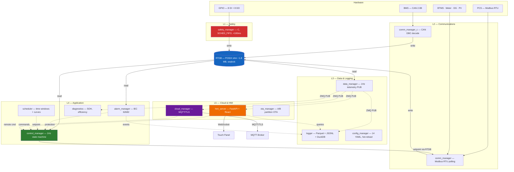

# EMS — Energy Management System for BESS

Energy Management System for Battery Energy Storage Systems (BESS). Manages BMS, PCS, BTMS, fire suppression, metering, diesel generators, and solar PV through a single Advantech ECU-1170-552A controller. Config-driven — one binary serves all topologies from 50 kWh residential to 6+ MWh container installations.

## Target Hardware

- **Controller**: Advantech ECU-1170-552A (TI AM6548: 4x Cortex-A53 + 2x Cortex-R5)
- **Dev OS**: Ubuntu 24.04 LTS
- **Prod OS**: Yocto Linux (planned migration at M5)

## Architecture

The system is organized into a 5-layer stack of 12 software modules:

| Layer | Module | Language | Role |
|-------|--------|----------|------|
| L1 Safety | `safety_manager` | C (PREEMPT_RT) | GPIO E-Stop, fire, flood — <100 ms response |
| L2 Comms | `comm_manager` | C/Python | CAN (BMS), Modbus RTU (PCS, BTMS, meter, DG, PV) |
| L3 Data | `data_manager` | C/Python | RTDB (POSIX shared memory + seqlock) |
| L3 Data | `logger` | C++/Python | 1 Hz Parquet + DuckDB + JSONL events |
| L3 Data | `config_manager` | Python | 14 YAML configs, JSON Schema validation, hot-reload |
| L4 App | `control_manager` | Python/C | 1 Hz state machine, power dispatch |
| L4 App | `alarm_manager` | Python | IEC 62682 alarm management |
| L4 App | `scheduler` | Python | Charge/discharge windows |
| L4 App | `diagnostics` | Python | System health monitoring |
| L5 Cloud | `cloud_manager` | Python | MQTT/TLS 1.3, mTLS |
| L5 Cloud | `ota_manager` | Python | A/B partition OTA updates |
| L5 Cloud | `hmi_server` | Python/React | Local HMI (7 screens) |

**IPC**: ZeroMQ (PUB/SUB + REQ/REP + PUSH/PULL) over `ipc://` sockets, MessagePack serialization.
**RTDB**: POSIX shared memory (`shm_open` + `mmap`) with seqlock concurrency — ~1.8 MB fixed-size struct.



## Project Layout

```
EMS/
├── src/                        # All 12 software modules
│   ├── common/                 # Shared code
│   │   ├── c/include/          # C headers: rtdb.h, seqlock.h, ipc_defs.h, ems_types.h
│   │   └── python/             # Python shared library (ems_common)
│   ├── safety_manager/         # L1 — pure C, PREEMPT_RT GPIO safety
│   ├── comm_manager/           # L2 — C (CAN DBC) + Python (Modbus)
│   │   ├── c/                  # CAN frame encode/decode
│   │   └── python/             # Modbus RTU client
│   ├── data_manager/           # L3 — C (RTDB writer) + Python (RTDB reader)
│   ├── logger/                 # L3 — C++ (fast path) + Python (Parquet/DuckDB)
│   ├── config_manager/         # L3 — Python, YAML + JSON Schema validation
│   ├── control_manager/        # L4 — C (fast loop) + Python (state machine)
│   ├── alarm_manager/          # L4 — Python, IEC 62682
│   ├── scheduler/              # L4 — Python, charge/discharge scheduling
│   ├── diagnostics/            # L4 — Python, health monitoring
│   ├── cloud_manager/          # L5 — Python, MQTT/TLS
│   ├── ota_manager/            # L5 — Python, A/B OTA
│   ├── hmi_server/             # L5 — Python backend + React/Vite frontend
│   │   └── frontend/           # React + Vite + Chart.js + Tailwind CSS
│   └── vendor/                 # Vendored C libraries
│       └── mpack/              # MessagePack for C (amalgamation)
│
├── config/
│   ├── schemas/                # 14 JSON Schema files (strict additionalProperties: false)
│   └── profiles/               # Per-topology config sets
│       ├── residential/        # 50 kWh, 1 rack, 16 cells
│       ├── commercial/         # 500 kWh, 4 racks
│       └── container/          # 6+ MWh, 16 racks, 2 clusters
│
├── tools/
│   ├── simulators/
│   │   ├── can_sim/            # CAN bus BMS simulator (vcan0, DBC-driven)
│   │   ├── modbus_sim/         # Modbus PCS simulator (RTU/TCP, register map)
│   │   └── gpio_harness/       # GPIO test harness (RTDB-backed, stuck pins)
│   ├── tui/                    # Developer TUI process manager (Textual)
│   ├── sim-all.sh              # Unified launcher — starts all 3 simulators
│   ├── validate_config.py      # Validate all YAML configs against JSON schemas
│   └── verify-dev-env.sh       # Check dev environment is correctly set up
│
├── tests/
│   ├── c/                      # C unit tests (CTest)
│   ├── test_scaffold.py        # Build system and workspace tests
│   ├── test_config_validation.py  # Schema validation tests
│   ├── test_rtdb.py            # RTDB shared memory tests
│   ├── test_ipc_contracts.py   # ZeroMQ + MessagePack IPC tests
│   ├── test_can_simulator.py   # CAN simulator tests
│   ├── test_modbus_simulator.py   # Modbus simulator tests
│   ├── test_gpio_harness.py    # GPIO harness tests
│   └── test_integration.py     # Integration smoke tests (all 3 simulators)
│
├── deploy/
│   ├── systemd/                # 12 service files + ems.target
│   ├── sudoers/                # Passwordless sudo rules for dev (vcan, ip link)
│   └── tmpfiles/               # systemd-tmpfiles configs (/run/ems)
│
├── cmake/
│   └── toolchains/
│       └── aarch64-linux.cmake # ARM64 cross-compile for ECU-1170
│
├── architecture/               # Architecture documents and diagrams (HTML, DOCX)
├── docs/                       # ECU bringup checklist and operational docs
├── .github/workflows/          # CI: pr-check.yml (build + test + lint + integration)
│
├── CMakeLists.txt              # Top-level CMake (C/C++ build)
├── pyproject.toml              # uv workspace root (12 Python members)
├── Makefile                    # Developer interface (make help for all targets)
└── uv.lock                    # Locked Python dependencies
```

## Prerequisites

| Tool | Version | Purpose |
|------|---------|---------|
| **uv** | latest | Python package manager (replaces pip) |
| **Python** | 3.12+ | Application runtime |
| **CMake** | 3.22+ | C/C++ build system |
| **Ninja** | any | Fast CMake backend |
| **GCC** | any | Native C compiler |
| **gcc-aarch64-linux-gnu** | any | ARM64 cross-compiler (for ECU builds) |
| **clang-format** | any | C code formatting |
| **bun** | latest | HMI frontend (React/Vite) |
| **can-utils** | any | `candump`, `cansend` for CAN testing |
| **socat** | any | Virtual serial ports for Modbus RTU tests |
| **libgpiod-dev** | any | GPIO library headers |

## Getting Started

### New machine (Ubuntu 24.04 VM)

If you're setting up a fresh Ubuntu 24.04 VM from scratch, the setup script handles everything — git, SSH keys, uv, bun, Node.js, VS Code, Claude Code, vcan persistence, `ems` dev group (for passwordless TUI operation), and all project dependencies:

```bash
# 1. Install git (only thing needed before cloning)
sudo apt-get update && sudo apt-get install -y git

# 2. Clone the repo (requires SSH key on GitHub — the script helps with this)
git clone git@github.com:ReVx-Energy/EMS.git
cd EMS

# 3. Run the full setup (interactive — will prompt for git name/email, SSH key, etc.)
bash tools/setup-dev-env.sh
```

The script is idempotent — safe to re-run after a partial failure or to pick up new tools.

### Existing machine (already has git, uv, bun)

If your machine already has the core tools installed:

```bash
git clone git@github.com:ReVx-Energy/EMS.git
cd EMS
make setup
```

`make setup` installs system packages, sets up vcan0, installs Python 3.12 via uv, syncs all Python dependencies, installs HMI frontend deps, and runs the environment verification script.

### 2. Build C targets

```bash
make build            # Native debug build
make build-arm        # ARM64 cross-compile for ECU
```

### 3. Run tests

```bash
make test             # All unit tests (ctest + pytest)
```

To run specific test suites:

```bash
uv run pytest tests/test_config_validation.py -v   # Config schema tests
uv run pytest tests/test_can_simulator.py -v        # CAN simulator tests
uv run pytest tests/test_rtdb.py -v                 # RTDB shared memory tests
uv run pytest tests/ -m "not integration" -v        # All unit tests (skip integration)
uv run pytest tests/ -m integration -v              # Integration tests only (needs vcan0)
```

### 4. Validate configuration

```bash
make validate
```

Validates all 14 YAML config files across all 3 profiles against their JSON schemas. Schemas enforce `additionalProperties: false` at every level — any unknown field is a hard error.

### 5. Lint and format

```bash
make lint             # Check C formatting + Python lint (no changes)
make fmt              # Auto-format C and Python code
```

## Running the System

There are two ways to run the full EMS simulator stack for development. The TUI is the recommended approach — it starts everything in the correct order from a single terminal.

### TUI Process Manager (recommended)

The TUI orchestrates all 18 EMS processes (simulators + managers) from a single terminal with phase-ordered startup, live log viewing, auto-restart, and error diagnostics.

```bash
# Build C targets first (required)
make build

# Launch the TUI
make tui                          # Residential profile (default)
make tui PROFILE=commercial       # Commercial profile
make tui PROFILE=container        # Container profile
```

**Keybindings:**

| Key | Action |
|-----|--------|
| `a` | Start all processes (phase-ordered) |
| `x` | Stop all processes (reverse order) |
| `s` / `k` / `r` | Start / Stop / Restart selected process |
| `Enter` | Show crash details (on errored process) |
| `p` | Cycle deployment profile |
| `l` | Toggle log panel |
| `q` | Quit (stops all processes first) |

The TUI starts processes in dependency order: prerequisites → simulators → RTDB → foundation services → comms → logger → application → HMI. Crashed processes auto-restart with exponential backoff.

### Manual Setup (multiple terminals)

See [docs/OPERATIONS.md](docs/OPERATIONS.md) for the manual multi-terminal approach.

## Running the Simulators

The simulators emulate BMS (CAN), PCS (Modbus), and safety GPIO hardware for development without the physical ECU.

### All simulators at once

```bash
make sim-all                           # Residential profile (default)
make sim-all PROFILE=commercial        # Commercial profile
make sim-all PROFILE=container         # Container profile
```

This starts all 3 simulators in the background with PID tracking and health checks. Press `Ctrl+C` for clean teardown. Logs go to `logs/sim-*.log`.

### Individual simulators

```bash
make sim-can          # CAN BMS simulator on vcan0
make sim-modbus       # Modbus PCS simulator (RTU over socat PTY)
make sim-gpio         # GPIO pin state viewer
```

### Verifying simulators are running

When `sim-all` is running, it prints a status line:

```
CAN: running (vcan0) | Modbus: running (TCP, :5020) | GPIO: running (RTDB)
```

You can also check individually:

```bash
# CAN — watch frames on vcan0
candump vcan0

# Modbus — check TCP port is listening
ss -tln | grep 5020

# GPIO — read RTDB shared memory state
uv run python -m tools.simulators.gpio_harness get all
```

### Fault injection

All simulators support YAML-configurable fault injection for testing degraded hardware scenarios. Add a `fault_injection` section to the relevant config file:

```yaml
# In bms_config.yaml — drop 5% of CAN frames, corrupt 2%
fault_injection:
  frame_drop_rate: 0.05
  corrupt_data: true

# In pcs_config.yaml — return Modbus exception on specific registers
fault_injection:
  exception_code: 2
  exception_registers: [0x500E, 0x500F]

# In gpio_config.yaml — pin 6 stuck, ignores writes
fault_injection:
  stuck_pins: [6]
```

## HMI Frontend

```bash
make dev-hmi          # Start Vite dev server (hot reload)
make build-hmi        # Production build
make test-hmi         # Run frontend tests
```

## Deployment

For ECU deployment via rsync:

```bash
make flash                           # Default: ems@192.168.1.100
make flash ECU_HOST=ems@10.0.0.50   # Custom ECU address
```

The ECU runs all 12 modules as systemd services under an `ems.target` group. Service files are in `deploy/systemd/`.

## CI

The GitHub Actions pipeline (`pr-check.yml`) runs on every PR to `master`:

1. **build-and-test** — CMake build, pytest (unit tests), config validation, ruff lint
2. **integration-test** — Sets up vcan0, runs integration smoke tests against all 3 simulators

## Make Targets

Run `make help` for the full list:

```
  help            Show this help
  setup           Install all dependencies (run once after clone)
  build           Build all C targets (native, Debug)
  build-arm       Cross-compile for ARM64 (ECU-1170)
  test            Run all unit tests (ctest + pytest)
  lint            Check C formatting and Python lint (no changes)
  fmt             Auto-format C and Python code
  tui             Launch EMS developer TUI process manager
  sim-all         Start all simulators (CAN + Modbus + GPIO)
  sim-can         Start CAN bus simulator on vcan0
  sim-modbus      Start Modbus PCS simulator (RTU over socat PTY)
  sim-gpio        Start GPIO test harness (RTDB mode, show all pins)
  build-hmi       Build HMI React frontend (production)
  dev-hmi         Start HMI dev server
  test-hmi        Run HMI unit tests
  flash           Deploy to ECU via rsync
  validate        Validate all YAML config files against JSON Schema
  clean           Remove build artifacts
```

## Operations Guide

For the complete guide on running, testing, debugging, and configuring the EMS — including simulator usage, HMI setup, configuration reference, ZMQ IPC details, and troubleshooting — see **[docs/OPERATIONS.md](docs/OPERATIONS.md)**.
