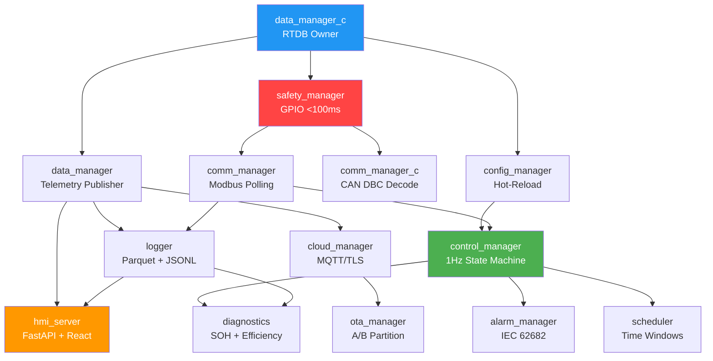
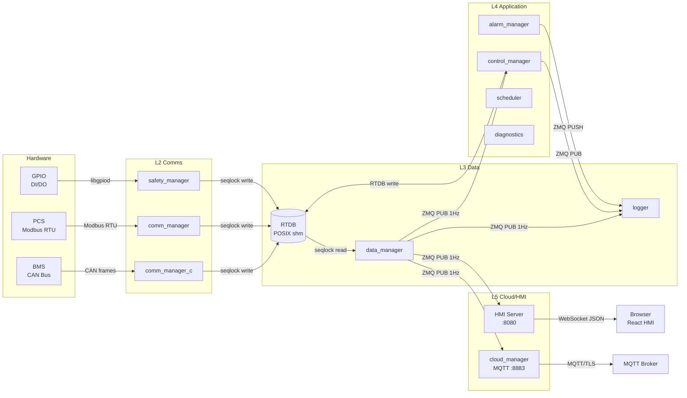
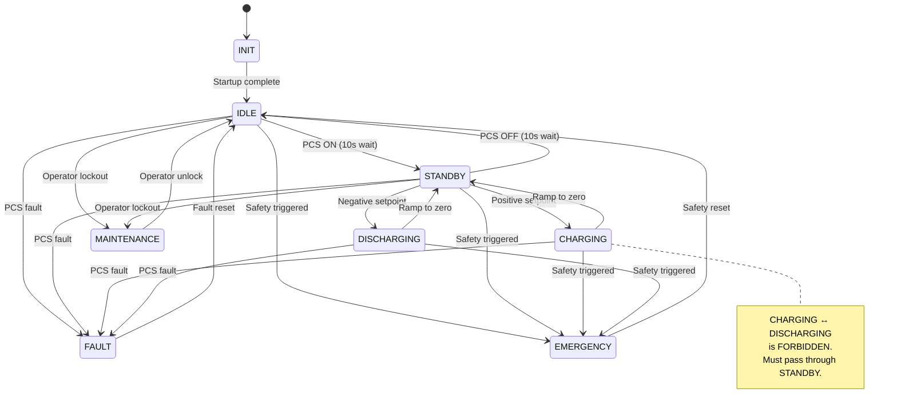
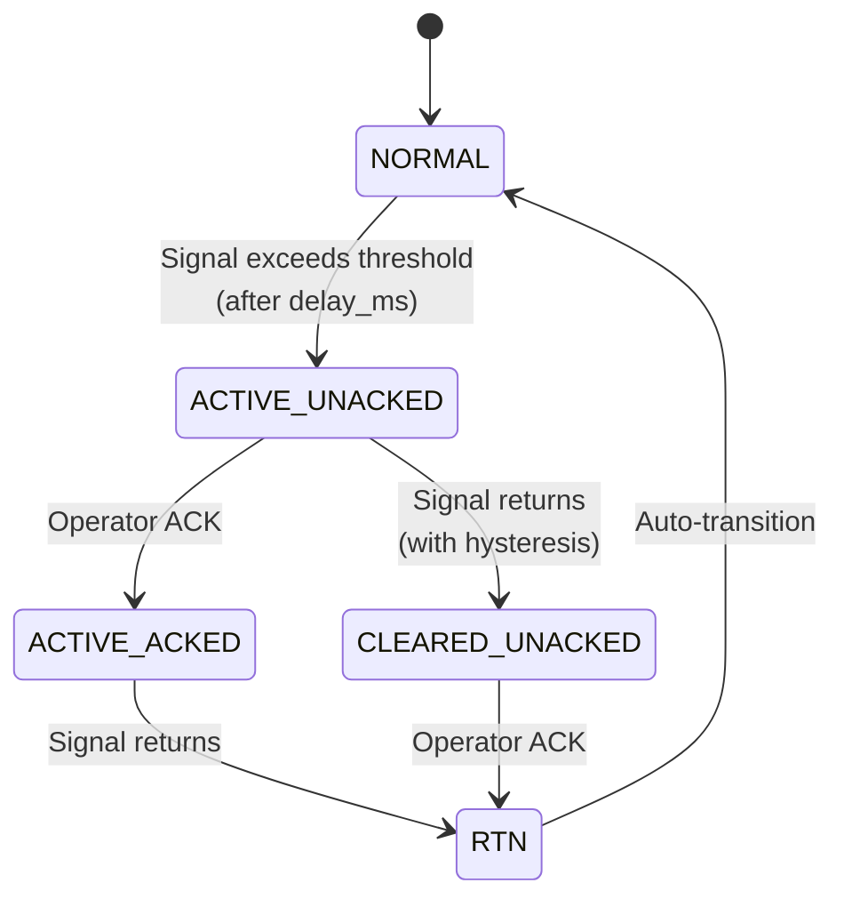
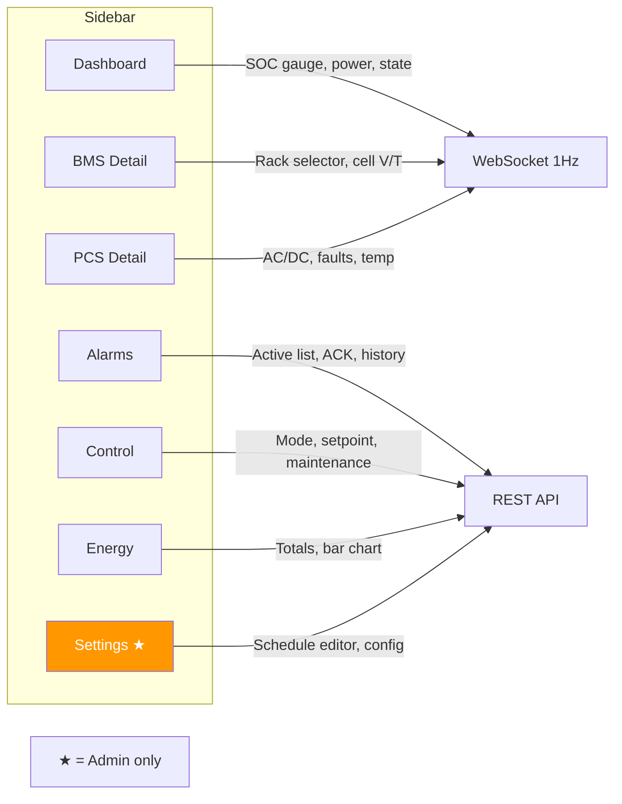
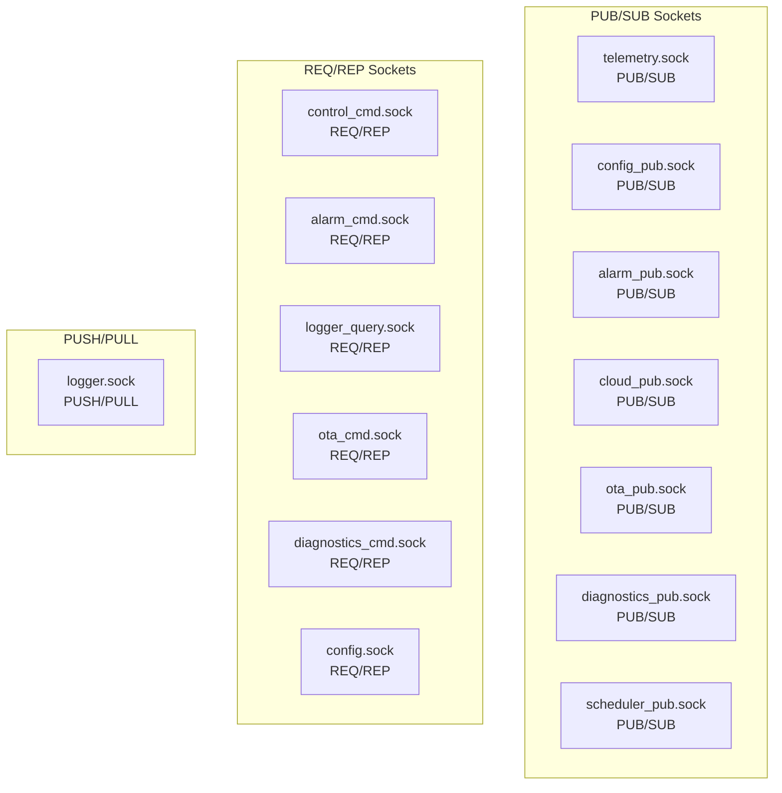

# EMS Operations Guide

Complete guide for setting up, running, testing, debugging, and configuring the EMS on a development VM or production ECU.

## Table of Contents

- [Quick Start](#quick-start)
- [System Architecture](#system-architecture)
- [Environment Setup](#environment-setup)
- [Building](#building)
- [Running the System](#running-the-system)
- [Simulators](#simulators)
- [HMI Frontend](#hmi-frontend)
- [Testing](#testing)
- [Configuration Reference](#configuration-reference)
- [ZMQ IPC Reference](#zmq-ipc-reference)
- [RTDB Shared Memory](#rtdb-shared-memory)
- [Data Storage](#data-storage)
- [Debugging](#debugging)
- [Common Issues](#common-issues)
- [Network and Ports](#network-and-ports)

---

## Quick Start

```bash
# 1. Clone and setup (run once)
git clone git@github.com:ReVx-Energy/EMS.git && cd EMS
bash tools/setup-dev-env.sh
bash tools/verify-dev-env.sh

# 2. Build
make build

# 3. Launch the TUI (starts everything in the correct order)
make tui
# Press 'a' to start all processes, 'q' to quit

# 4. Open HMI
open http://localhost:8080
# Login: PIN 1234 (operator) or 5678 (admin)

# 5. Run tests
make test                  # Unit tests (~30s)
make test-integration      # Full integration (~40 min)
```

---

## System Architecture

### Module Startup Order



### Data Flow



### Control Loop (1Hz)



### Alarm Lifecycle (IEC 62682)



---

## Environment Setup

### Prerequisites

- **OS**: Ubuntu 24.04 LTS (VM or bare metal)
- **RAM**: 4 GB minimum (8 GB for container-scale testing)
- **Disk**: 20 GB free
- **Network**: Internet access for setup (packages, npm modules)

### Automated Setup

```bash
# Full setup (idempotent — safe to re-run)
bash tools/setup-dev-env.sh

# Verify everything is installed
bash tools/verify-dev-env.sh
```

The setup script installs:
- Build tools: cmake, ninja, gcc, aarch64-linux-gnu cross-compiler
- Libraries: libzmq3-dev, libgpiod-dev
- CAN tools: can-utils, socat, vcan kernel module
- Python: uv + Python 3.12
- JavaScript: bun + Node.js 22
- Claude Code CLI
- **`ems` group**: adds your user to it for passwordless vcan/ip-link sudo
- **Sudoers drop-in**: `/etc/sudoers.d/ems-dev` — scoped to vcan module loading and interface creation
- **tmpfiles config**: `/etc/tmpfiles.d/ems-dev.conf` — creates `/run/ems` on boot with `ems` group write access
- vcan0 persistence via systemd-networkd

After setup, the TUI can start all processes without any sudo password prompts.

### Manual Dev Permissions Setup

If you skipped the full setup script, you can configure permissions manually:

```bash
# 1. Create ems group and add your user
sudo groupadd ems
sudo usermod -aG ems $USER

# 2. Install sudoers drop-in (passwordless vcan commands)
sudo cp deploy/sudoers/ems-dev.sudo /etc/sudoers.d/ems-dev
sudo chmod 0440 /etc/sudoers.d/ems-dev

# 3. Install tmpfiles config (/run/ems on boot)
sudo cp deploy/tmpfiles/ems-dev.conf /etc/tmpfiles.d/ems-dev.conf
sudo systemd-tmpfiles --create /etc/tmpfiles.d/ems-dev.conf

# 4. Log out and back in (or: newgrp ems)
```

### Manual Virtual CAN Setup

If vcan isn't persisted after reboot:

```bash
sudo modprobe vcan can can_raw
sudo ip link add dev vcan0 type vcan
sudo ip link set up vcan0
```

---

## Building

```bash
# Native x86 debug build (for development)
make build

# ARM64 cross-compile (for ECU-1170-552A)
make build-arm

# Build HMI React frontend
make build-hmi

# Validate all config files
make validate

# Clean build artifacts
make clean
```

### Build Output

| Target | Directory | Contents |
|--------|-----------|----------|
| Native | `build/` | safety_manager, comm_manager_c, data_manager_c, libems_rtdb.so |
| ARM64 | `build-arm/` | Same binaries cross-compiled for aarch64 |
| HMI | `src/hmi_server/frontend/dist/` | Static React build (JS, CSS, HTML) |

---

## Running the System

There are two ways to run the full EMS simulator stack during development. The **TUI** is the recommended approach — it handles startup order, log aggregation, and process lifecycle from a single terminal. The **manual** approach is available when you need finer control or want to run individual modules in isolation.

### Option 1: TUI Process Manager (recommended)

The TUI orchestrates all 18 EMS processes (3 simulators + 15 managers) from a single terminal. It starts processes in the correct dependency order, captures stdout/stderr, auto-restarts crashed processes with exponential backoff, and shows crash details in an error modal.

**Prerequisites:**
- Build C targets first — the TUI checks for binaries and warns if missing
- Run `make setup` or `bash tools/setup-dev-env.sh` once to configure the `ems` group, sudoers, and `/run/ems` (see [Environment Setup](#environment-setup))

```bash
make build
```

> **Note:** The TUI auto-detects if vcan0 and `/run/ems` already exist and skips the sudo-requiring prerequisite steps. After running `make setup` once, no sudo password prompts will appear during normal TUI usage.

**Launch the TUI:**

```bash
make tui                          # Residential profile (default)
make tui PROFILE=commercial       # Commercial profile
make tui PROFILE=container        # Container profile

# Or invoke directly:
uv run python -m tools.tui --profile residential
```

**Keybindings:**

| Key | Action |
|-----|--------|
| `a` | Start all processes (phase-ordered startup) |
| `x` | Stop all processes (reverse phase order) |
| `s` | Start selected process |
| `k` | Stop selected process |
| `r` | Restart selected process |
| `Enter` | Show crash details modal (when process status is ERROR) |
| `Escape` | Dismiss error modal |
| `p` | Cycle deployment profile (restarts affected simulators) |
| `l` | Toggle log panel visibility |
| `q` | Quit (gracefully stops all processes first) |

**Startup phases (in order):**

| Phase | Processes | Notes |
|-------|-----------|-------|
| 0 prereq | vCAN setup, IPC directory | Auto-skipped if already satisfied |
| 1 sims | CAN Simulator, Modbus Simulator | Background daemons with health checks |
| 2 rtdb | data_manager_c | Creates `/dev/shm/ems_rtdb` — must complete before phase 3 |
| 3 foundation | config_manager, data_manager (Py), safety_manager | Parallel start |
| 4 comms | comm_manager_c, comm_manager (Py) | CAN + Modbus polling |
| 5 data | logger | Parquet + JSONL + DuckDB |
| 6 app | control_manager, alarm_manager, scheduler | 1Hz control loop + alarms |
| 7 ui | hmi_server | FastAPI + React on :8080 |
| 8 optional | cloud_manager, diagnostics, ota_manager | Not started by `a` — start individually with `s` |

**Error handling:** When a process crashes, its status shows blinking red `ERROR` in the table. Select the row and press `Enter` to open a modal showing exit code, signal name, crash timestamp, restart count, and the last 50 lines of stderr. Press `r` in the modal to restart immediately, or `Escape` to dismiss.

**Profile switching:** Press `p` to cycle profiles (residential → commercial → container). Only processes whose commands reference the profile (CAN sim, Modbus sim) are restarted — all other processes stay running.

**Process configuration:** The process list is defined in `tools/tui/processes.yaml`. You can edit this file to add, remove, or reorder processes, change commands, adjust health checks, or modify auto-restart settings without touching Python code.

### Option 2: Manual Multi-Terminal Setup

For finer control, you can start each process manually in separate terminals. Processes must be started in the order shown below — each depends on the ones above it.

**Terminal 1 — Simulators:**
```bash
make sim-all
# Or with a specific profile:
make sim-all PROFILE=commercial
```

**Terminal 2 — Core modules (start in order):**
```bash
# 1. RTDB owner (creates shared memory — must start first)
./build/src/data_manager/c/data_manager_c 1 4 10 16 8  # clusters racks modules cells temps

# 2. Config manager
uv run python -m ems_config_manager --config-dir config/ --schema-dir config/schemas/

# 3. Data manager Python (telemetry publisher)
uv run python -m ems_data_manager

# 4. Safety manager (RTDB backend for dev — no real GPIO)
./build/src/safety_manager/safety_manager --rtdb-backend

# 5. Comm managers (CAN + Modbus)
./build/src/comm_manager/c/comm_manager_c --interface vcan0 --base-id 0x18FF0003 &
uv run python -m ems_comm_manager --config config/

# 6. Logger
uv run python -m ems_logger --config config/logger_config.yaml

# 7. Control manager
uv run python -m ems_control_manager

# 8. Alarm manager
uv run python -m ems_alarm_manager

# 9. Scheduler
uv run python -m ems_scheduler

# 10. HMI server
uv run python -m ems_hmi_server

# 11. Cloud manager (optional — needs MQTT broker)
uv run python -m ems_cloud_manager

# 12. Diagnostics (optional)
uv run python -m ems_diagnostics
```

### Running a Specific Module Only

Run any module independently for debugging:

```bash
# Logger with verbose logging
uv run python -m ems_logger --config config/logger_config.yaml --log-level DEBUG

# Alarm manager with custom config
uv run python -m ems_alarm_manager --config config/alarms_config.yaml --log-level DEBUG

# Control manager
uv run python -m ems_control_manager --config config/control_config.yaml --log-level DEBUG
```

### Stopping

**TUI:** Press `q` — gracefully stops all processes (SIGTERM, then SIGKILL after 5s).

**Manual:** All Python modules handle SIGTERM/SIGINT gracefully:
```bash
kill -TERM <pid>   # or Ctrl+C
```

---

## Simulators

### CAN Bus Simulator (BMS)

Generates realistic BMS CAN frames on virtual CAN interface.

```bash
# Default: residential profile, vcan0
uv run python -m tools.simulators.can_sim

# Commercial profile with 16 racks
uv run python -m tools.simulators.can_sim \
  --config config/profiles/commercial/bms_config.yaml \
  --system-config config/profiles/commercial/system_config.yaml

# Custom rack count
uv run python -m tools.simulators.can_sim --racks 8 --verbose
```

**What it generates:**
- 10 CAN message types per rack at dual rates (300ms fast, 2000ms slow)
- PackSummary: voltage, current, SOC, SOH, fault code
- CellVoltage_01-07: 4 cells per message, realistic 3.2-3.5V with drift
- CellTemperature: 8 temps per message with noise
- RackStatus: online flag, min/max/avg cell voltage

**Verify CAN traffic:**
```bash
candump vcan0                    # Watch all frames
candump vcan0,18FF0003:1FFFFFFF  # Filter specific CAN ID
cansend vcan0 18FF0003#0102030405060708  # Send a test frame
```

### Modbus Simulator (PCS)

Emulates a PCS inverter with state machine and register map.

```bash
# TCP mode (default port 5020)
uv run python -m tools.simulators.modbus_sim --transport tcp

# RTU mode over virtual serial port
uv run python -m tools.simulators.modbus_sim --transport rtu

# Custom TCP port
uv run python -m tools.simulators.modbus_sim --transport tcp --tcp-port 5025 --verbose
```

**Key registers:**
| Address | Name | Scale | R/W |
|---------|------|-------|-----|
| 0x500E | Active power setpoint | kW × 10 | RW |
| 0x0291 | PCS on/off | 1 = ON | RW |
| 0x5064 | Fault reset | Write 1 | RW |
| 0x6039 | Total active power | kW × 10 | RO |
| 0x0030 | Operating state | 0-4 enum | RO |

### GPIO Harness

Manipulates GPIO state in RTDB (no real hardware needed).

```bash
# Show all GPIO pin states
uv run python -m tools.simulators.gpio_harness get all

# Set E-Stop NO pin high (trigger E-Stop)
uv run python -m tools.simulators.gpio_harness set DI-6 high

# Set both E-Stop channels atomically
uv run python -m tools.simulators.gpio_harness set DI-6=high DI-7=low

# Get specific pin by name
uv run python -m tools.simulators.gpio_harness get ESTOP_NO
```

**Pin mapping:**

| Pin | Name | Function |
|-----|------|----------|
| DI-0 | ACDB_FEEDBACK | Grid contactor feedback |
| DI-1 | FLOOD_SENSOR | Water ingress |
| DI-2 | DOOR_SWITCH | Cabinet door |
| DI-3 | SMOKE_DETECTOR | Fire detection |
| DI-4 | HEAT_DETECTOR | Thermal anomaly |
| DI-5 | SPARE_DI5 | Site-specific |
| DI-6 | ESTOP_NO | E-Stop normally open |
| DI-7 | ESTOP_NC | E-Stop normally closed |
| DO-0 | ACDB_TRIP | Grid disconnect |
| DO-1 | EXTINGUISHER | Fire suppression |
| DO-2 | WARNING_LAMP | Amber warning |
| DO-3 | RUNNING_LAMP | Green running |
| DO-4 | FAULT_LAMP | Red fault |
| DO-5 | PCS_STOP | Emergency PCS stop |
| DO-6 | SIREN | Audible alarm |
| DO-7 | SPARE_DO7 | Site-specific |

### All Simulators Together

```bash
# Launch all with residential profile
make sim-all

# Commercial profile
make sim-all PROFILE=commercial

# Container profile with verbose
make sim-all PROFILE=container VERBOSE=1
```

Logs go to `logs/sim-can.log` and `logs/sim-modbus.log`.

---

## HMI Frontend

### Development Mode (Hot Reload)

```bash
# Start Vite dev server
make dev-hmi
# Open http://localhost:5173
```

The dev server proxies API requests to `http://localhost:8080` and WebSocket to `ws://localhost:8080`.

### Production Build

```bash
make build-hmi
# Output: src/hmi_server/frontend/dist/
# Served by FastAPI at http://localhost:8080
```

### HMI Screens



| Screen | URL | Auth | Data Source |
|--------|-----|------|------------|
| Dashboard | `/` | Operator | WebSocket (1Hz) |
| BMS | `/bms` | Operator | WebSocket (1Hz) |
| PCS | `/pcs` | Operator | WebSocket (1Hz) |
| Alarms | `/alarms` | Operator | WebSocket + REST |
| Control | `/control` | Operator | WebSocket + REST |
| Energy | `/energy` | Operator | REST (on-demand) |
| Settings | `/settings` | **Admin** | REST (on-demand) |

### Authentication

| PIN | Level | Access |
|-----|-------|--------|
| `1234` | Operator | Read all screens, send commands (mode, setpoint, ACK) |
| `5678` | Admin | Everything + Settings screen + maintenance enter/exit |

PIN hashes are in `config/hmi_config.yaml` (bcrypt). Generate new hashes:
```bash
python3 -c "import bcrypt; print(bcrypt.hashpw(b'YOUR_PIN', bcrypt.gensalt()).decode())"
```

---

## Testing

### Unit Tests

```bash
make test                    # All unit tests (C + Python)
make test-hmi                # React frontend tests (vitest)
uv run pytest tests/ -v      # Python only, verbose
uv run pytest tests/ -k "test_alarm"  # Filter by name
```

### Integration Tests

```bash
make test-integration        # M1 integration (~40 min)
make test-integration-m2     # M2 control + alarm tests
make test-integration-m3     # M3 HMI + scheduler tests
make test-integration-m4     # M4 cloud + OTA tests
```

### Config Validation

```bash
make validate                # All 14 YAML configs against JSON Schema
uv run python -m ems_config_manager validate config/alarms_config.yaml  # Single file
```

### Test Markers

```bash
uv run pytest -m "not integration"     # Skip slow integration tests
uv run pytest -m "not rtu"             # Skip Modbus RTU tests
uv run pytest -m "not gpio_sim"        # Skip GPIO kernel module tests
uv run pytest -m hw                    # Hardware validation only
```

---

## Configuration Reference

All configs are in `config/` with JSON Schema validation in `config/schemas/`.

### Hot-Reloadable Configs (change without restart)

| File | What Changes Live | What Requires Restart |
|------|-------------------|----------------------|
| `control_config.yaml` | SOC limits, power limits, source priority, fault retry count | loop_interval_ms |
| `alarms_config.yaml` | All thresholds, hysteresis, delays, enable/disable | — (everything is mutable) |
| `schedule_config.yaml` | Time windows, power curve, mode, day/night times | — (everything is mutable) |

### Non-Reloadable Configs (require service restart)

| File | Purpose | Key Settings |
|------|---------|-------------|
| `system_config.yaml` | System topology | cluster_count, racks_per_cluster, modules_per_rack, cells_per_module, temps_per_module |
| `bms_config.yaml` | BMS CAN interface | can_interface (vcan0), bitrate (500000), dbc_path, base_can_id, heartbeat_timeout_ms |
| `pcs_config.yaml` | PCS Modbus | protocol (rtu/tcp), device, baudrate, slave_id, register_map_path, poll_interval_ms |
| `btms_config.yaml` | BTMS Modbus | device, slave_id, poll_interval_ms |
| `meter_config.yaml` | Energy meter | device, slave_id, poll_interval_ms |
| `dg_config.yaml` | Diesel generator | device, slave_id, poll_interval_ms |
| `pv_config.yaml` | Solar PV | device, slave_id, poll_interval_ms |
| `gpio_config.yaml` | GPIO pins | DI pin names/polarity/debounce, DO pin names/initial state |
| `logger_config.yaml` | Data storage | data_dir, parquet_retention_days (90), jsonl_retention_days (180), compression (snappy) |
| `hmi_config.yaml` | HMI server | http_port (8080), operator_pin_hash, admin_pin_hash, session_timeout_s |
| `cloud_config.yaml` | MQTT broker | broker host/port (8883), cert paths, telemetry_interval_s, offline_buffer max_hours/max_mb |
| `network_config.yaml` | Network | eth0 (WAN), eth1 (LAN) interface configs |

### Deployment Profiles

```bash
# Use a specific profile
EMS_PROFILE=commercial uv run python -m ems_config_manager

# Profiles override all 14 configs:
config/profiles/residential/  # 50 kWh, 1×4 racks, 25 kW max
config/profiles/commercial/   # 500 kWh, 4×16 racks, 250 kW max
config/profiles/container/    # 6+ MWh, 4×16 racks, 3000 kW max
```

| Parameter | Residential | Commercial | Container |
|-----------|------------|-----------|-----------|
| Clusters | 1 | 4 | 4 |
| Racks/Cluster | 4 | 16 | 16 |
| Modules/Rack | 8 | 20 | 20 |
| Cells/Module | 16 | 108 | 108 |
| Max Power | 25 kW | 250 kW | 3000 kW |
| Telemetry Interval | 60s | 30s | 10s |
| Offline Buffer | 24h/50MB | 48h/200MB | 168h/500MB |

---

## ZMQ IPC Reference

All inter-process communication uses ZeroMQ over Unix domain sockets.



### Socket Directory: `/run/ems/`

| Socket | Type | Publisher/Server | Subscribers/Clients |
|--------|------|-----------------|-------------------|
| `telemetry.sock` | PUB/SUB | data_manager | control, alarm, cloud, HMI, diagnostics, logger |
| `config_pub.sock` | PUB/SUB | config_manager | control, alarm, scheduler |
| `alarm_pub.sock` | PUB/SUB | alarm_manager | control, cloud, HMI |
| `cloud_pub.sock` | PUB/SUB | cloud_manager | HMI |
| `ota_pub.sock` | PUB/SUB | ota_manager | HMI |
| `diagnostics_pub.sock` | PUB/SUB | diagnostics | HMI |
| `scheduler_pub.sock` | PUB/SUB | scheduler | control |
| `control_cmd.sock` | REQ/REP | control_manager | HMI, scheduler, cloud |
| `alarm_cmd.sock` | REQ/REP | alarm_manager | HMI, cloud |
| `logger_query.sock` | REQ/REP | logger | HMI, diagnostics |
| `ota_cmd.sock` | REQ/REP | ota_manager | cloud |
| `diagnostics_cmd.sock` | REQ/REP | diagnostics | HMI |
| `config.sock` | REQ/REP | config_manager | (future consumers) |
| `logger.sock` | PUSH/PULL | all modules → logger | logger |

### Message Envelope (MessagePack)

**Telemetry (PUB/SUB):**
```json
{"ts": 1710500000000, "seq": 42, "src": "data_manager", "topic": "pcs", "payload": {"active_power": 15.2, "dc_voltage": 400.1}}
```

**Command (REQ/REP):**
```json
// Request:
{"action": "mode_change", "params": {"target_state": "standby"}}
// Response:
{"status": "ok", "result": {"from": "idle", "to": "standby"}}
```

**Event (PUSH/PULL):**
```json
{"ts": 1710500000000, "src": "alarm_manager", "severity": "error", "event_type": "alarm", "message": "Cell voltage low", "data": {"alarm_id": "cell_voltage_low"}}
```

---

## RTDB Shared Memory

The Real-Time Database is a POSIX shared memory segment (`/dev/shm/ems_rtdb`).

### Structure

| Section | Writer | Fields |
|---------|--------|--------|
| `clusters[8].racks[16]` | comm_manager_c | pack_v, pack_i, pack_soc, pack_soh, min/max/avg cell_v/cell_t, fault_code, online |
| `pcs` | comm_manager (Python) | ac_voltage, ac_current, active_power, reactive_power, dc_voltage, temperature, state, fault_code |
| `gpio` | safety_manager | di[8], do_state[8] |
| `meter` | comm_manager (Python) | voltage, current, active_power, frequency, energy_import/export |
| `btms` | comm_manager (Python) | inlet_temp, outlet_temp, fan_speed_pct, cooling_active |
| `system` | control_manager | control_state, source_priority, active_setpoint_kw, total_soc, pcs_command, pcs_command_seq |
| `can_health[2]` | comm_manager_c | bus_state, tx_error_count, rx_error_count |

**Total size:** ~1.8 MB (fixed, regardless of topology)

### Inspect RTDB from Python

```python
from ems_common.rtdb import attach_rtdb, detach_rtdb

shm, rtdb = attach_rtdb()
print(f"Magic: 0x{rtdb.magic:08X}")
print(f"SOC: {rtdb.clusters[0].racks[0].pack_soc:.1f}%")
print(f"PCS power: {rtdb.pcs.active_power:.1f} kW")
print(f"Control state: {rtdb.system.control_state}")
print(f"DI-6 (E-Stop NO): {rtdb.gpio.di[6]}")
detach_rtdb(shm)
```

---

## Data Storage

### Logger Output

```
data/
├── 2026/03/16/
│   ├── telemetry_0_00.parquet    # Cluster 0, hour 00
│   ├── telemetry_0_01.parquet    # Cluster 0, hour 01
│   ├── telemetry_system_00.parquet  # PCS/meter/btms/gpio/system
│   └── ...
├── events/
│   └── 2026/03/
│       └── events_20260316.jsonl  # All events for the day
└── cloud_buffer/                  # MQTT offline buffer (when disconnected)
    └── 2026/03/16/
        └── cloud_00.jsonl
```

### Query Logger via DuckDB

```bash
# Direct DuckDB query on Parquet files
python3 -c "
import duckdb
con = duckdb.connect()
print(con.sql(\"SELECT * FROM 'data/2026/03/16/telemetry_system_00.parquet' LIMIT 5\"))
"
```

### Retention

| Data Type | Default Retention | Config Key |
|-----------|------------------|-----------|
| Parquet telemetry | 90 days | `logger_config.yaml → storage.parquet_retention_days` |
| JSONL events | 180 days | `logger_config.yaml → storage.jsonl_retention_days` |
| Cloud buffer | 24-168 hours | `cloud_config.yaml → offline_buffer.max_hours` |
| RTDB snapshots | Last 10 | `data_manager → --snapshot-count` |

Cleanup runs every 5 minutes. FIFO deletion order: Parquet first, then JSONL.

---

## Debugging

### Check Module Health

```bash
# Check if RTDB exists
ls -la /dev/shm/ems_rtdb

# Check ZMQ socket files
ls -la /run/ems/

# Monitor ZMQ telemetry (Python one-liner)
uv run python -c "
import zmq, msgpack
ctx = zmq.Context()
s = ctx.socket(zmq.SUB)
s.connect('ipc:///run/ems/telemetry.sock')
s.setsockopt_string(zmq.SUBSCRIBE, '')
while True:
    parts = s.recv_multipart()
    topic = parts[0].decode()
    data = msgpack.unpackb(parts[1])
    print(f'{topic}: {data}')
"
```

### Send Manual Commands

```bash
# Send mode_change to control_manager
uv run python -c "
import zmq, msgpack
from ems_common.ipc import SOCK_CONTROL_CMD, encode_command_request, decode_command_response
ctx = zmq.Context()
s = ctx.socket(zmq.REQ)
s.connect(SOCK_CONTROL_CMD)
s.send(encode_command_request('mode_change', {'target_state': 'standby'}))
resp = decode_command_response(s.recv())
print(resp)
"
```

### Check Active Alarms

```bash
uv run python -c "
import zmq
from ems_common.ipc import SOCK_ALARM_CMD, encode_command_request, decode_command_response
ctx = zmq.Context()
s = ctx.socket(zmq.REQ)
s.connect(SOCK_ALARM_CMD)
s.send(encode_command_request('get_active_alarms', {}))
resp = decode_command_response(s.recv())
for alarm in resp.get('result', {}).get('alarms', []):
    print(f\"{alarm['alarm_id']}: {alarm['severity']} ({alarm['state']})\")
"
```

### Watch CAN Bus

```bash
candump vcan0                          # All frames
candump vcan0 -t d                     # With timestamps
candump -L vcan0 > can_dump.log        # Log to file
```

### Check Modbus Registers

```bash
# Read PCS operating state (register 0x0030) via TCP
uv run python -c "
from pymodbus.client import AsyncModbusTcpClient
import asyncio
async def main():
    c = AsyncModbusTcpClient('localhost', port=5020)
    await c.connect()
    r = await c.read_holding_registers(0x0030, 1, slave=1)
    print(f'PCS state: {r.registers[0]}')  # 0=STANDBY,1=STARTING,2=RUNNING,3=STOPPING,4=FAULT
    await c.close()
asyncio.run(main())
"
```

### Log Files

All modules log to stdout (captured by systemd journal on production):

```bash
# On production ECU
journalctl -u ems-control-manager -f     # Follow control_manager logs
journalctl -u ems-safety-manager -f       # Follow safety_manager logs

# On dev (stdout)
uv run python -m ems_control_manager --log-level DEBUG 2>&1 | tee control.log
```

---

## Common Issues

| Issue | Cause | Fix |
|-------|-------|-----|
| TUI hangs on startup | sudo password prompt for vcan/mkdir | Run `make setup` once to install sudoers + tmpfiles (see [Environment Setup](#environment-setup)) |
| `FileNotFoundError: /dev/shm/ems_rtdb` | data_manager_c not running | Start `data_manager_c` first (TUI handles this automatically) |
| `zmq.error.ZMQError: Address already in use` | Previous instance still running | `kill` old process, or check `ls /run/ems/` |
| `ModuleNotFoundError: ems_common` | Python deps not installed | `uv sync --all-packages` |
| CAN frames not appearing | vcan0 not configured | `sudo ip link add vcan0 type vcan && sudo ip link set up vcan0` |
| HMI shows "Waiting for data..." | data_manager not publishing | Start data_manager + comm_manager with simulators |
| Alarms stuck at 100% SOH | Verifier false positive — code is correct | Check `pack_soh` field in ZMQ telemetry |
| WebSocket disconnects in dev | Vite proxy issue | Ensure HMI backend runs on port 8080 |
| `bcrypt` import error | Missing dependency | `cd src/hmi_server && uv add bcrypt` |
| Permission denied on `/run/ems/` | Directory doesn't exist | `sudo mkdir -p /run/ems && sudo chown $USER /run/ems` |

---

## Network and Ports

| Service | Port | Protocol | Interface |
|---------|------|----------|-----------|
| HMI Server | 8080 | HTTP + WebSocket | eth1 (LAN) or localhost |
| MQTT Broker | 8883 | MQTT over TLS 1.3 | eth0 (WAN) |
| Modbus Sim (TCP) | 5020 | Modbus TCP | localhost (dev only) |
| Vite Dev Server | 5173 | HTTP | localhost (dev only) |

### Hardware Interfaces (ECU-1170-552A)

| Interface | Connection | Protocol |
|-----------|-----------|----------|
| CAN0 | BMS Cluster 1 | CAN 2.0B DBC Layer 2 |
| CAN1 | BMS Cluster 2 | CAN 2.0B DBC Layer 2 |
| RS485-1 | PCS Inverter | Modbus RTU 9600/8N1 |
| RS485-2 | Energy Meter | Modbus RTU 9600/8N1 |
| RS485-3 | BTMS Controller | Modbus RTU 9600/8N1 |
| RS485-4 | DG / PV Inverter | Modbus RTU 9600/8N1 |
| ETH0 | WAN (Cloud) | MQTT/TLS, NTP |
| ETH1 | LAN (HMI) | HTTP, static IP 192.168.1.100 |
| GPIO | Safety I/O | 8 DI + 8 DO (libgpiod) |
| HDMI | Touch Panel | 10″ or 15″ React HMI |
